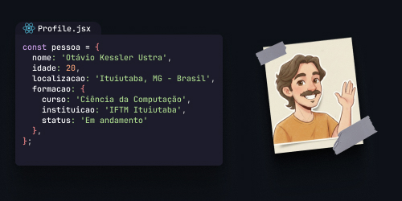

  

## Sobre mim

- 👋 Olá, sou o Otávio. Sou estudante de Ciência da Computação pelo IFTM Ituiutaba.
- 👀 Me interesso pela área de desenvolvimento web.
- 🧑‍💻 Procuro sempre melhorar minhas habilidades e me aprofundar sobre o mundo da programação.

  
  &nbsp;
  

## Minhas Skills

**Stack de Desenvolvimento ▼**

**DevOps ▼**

**Ferramentas de Desenvolvimento ▼**

 

## Dados 

    
    

 

## Projetos em destaque

### [Dogs - Rede Social](https://github.com/kessleru/Social-Media-React)

**React, Vite, Tailwind CSS, React Router, Victory, JWT**  
Aplicação completa de rede social com autenticação JWT, sistema de login/registro, feed com scroll infinito, upload de fotos, sistema de comentários, visualização de perfis públicos e dashboard com estatísticas em gráficos interativos (Victory).

🌐 **Live:** [Vercel](https://social-media-react-bice.vercel.app/)

---

### [Sky Atlas](https://github.com/kessleru/Sky-Atlas)

**React, Vite, TypeScript, Tailwind CSS, TanStack Query, Zod, Shadcn UI**  
Um visualizador meteorológico global em tempo real que permite explorar as condições climáticas de qualquer lugar do planeta por meio de um mapa interativo.

🌐 **Live:** [Vercel](https://sky-atlas-eight.vercel.app/)

---

### [UK - News](https://github.com/kessleru/Hacker-News-React)

**React, Vite, Tailwind CSS, Axios**  
Leitor minimalista do Hacker News que consome a API oficial (Firebase) e exibe as notícias mais recentes com título, domínio, autor e tempo relativo.  

🌐 **Live:** [Vercel](https://hacker-news-react-one.vercel.app/)

---

### [Forest Web](https://github.com/kessleru/Forest-Web)

**HTML5, Tailwind, JavaScript, Vite**  
Uma landing page para aluguel de casas e chalés em florestas, focada em conectar viajantes a refúgios naturais com conforto e estilo.

🌐 **Live:** [Vercel](https://forest-web-six.vercel.app/)

---

### [Aplicação Web Interativa - Animais Fantásticos](https://github.com/kessleru/Animais-Web)

**HTML5, CSS3, JavaScript ES6, Docker, Azure, Let's Encrypt**  
Site interativo sobre animais selvagens com infraestrutura moderna em produção.  

🌐 **Live:** h̵t̵t̵p̵s̵:̵/̵/̵k̵e̵s̵s̵l̵e̵r̵u̵.̵d̵e̵v̵ ou [Pages](https://kessleru.github.io/Animais-Web/)

---

### [Simple Todo List](https://github.com/kessleru/Todo-List-js)

**HTML5, CSS3, JavaScript**  
Aplicação simples e prática de lista de tarefas com interface intuitiva e funcionalidades essenciais.  

🌐 **Live:** [Pages](https://kessleru.github.io/Todo-List-js/)
